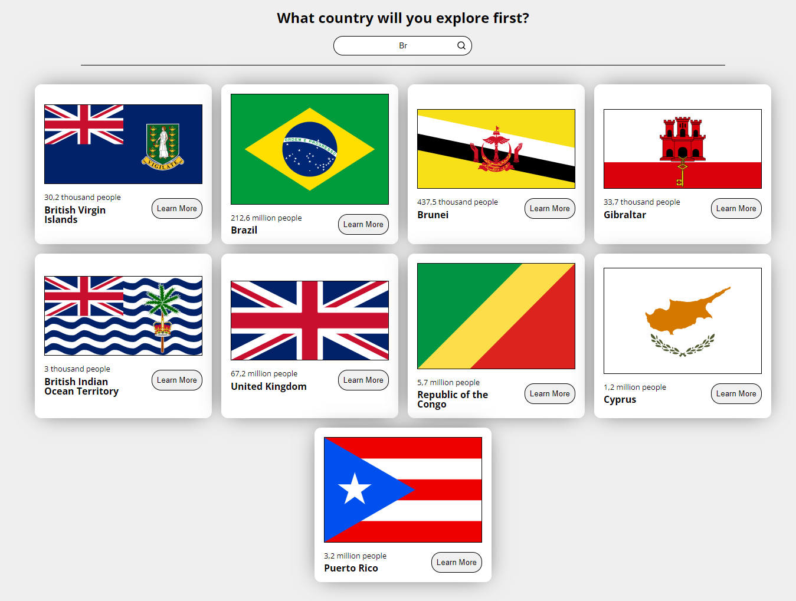
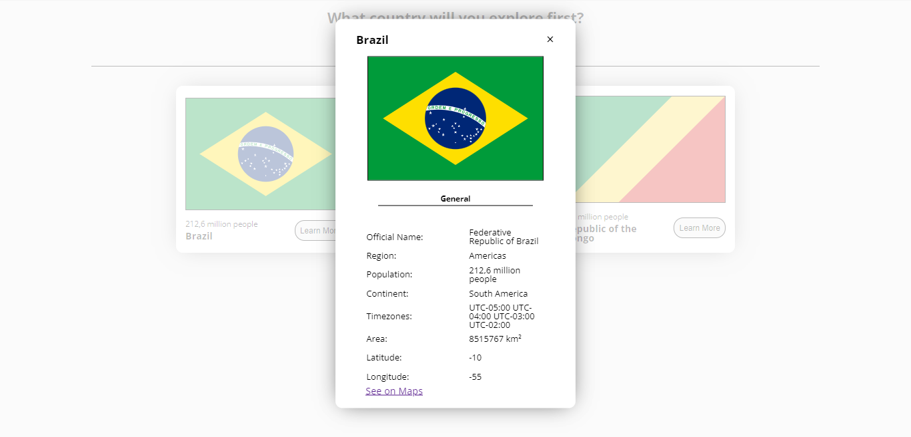

# Countries React App
Este é um projeto de uma aplicação web desenvolvida em React que permite ao usuário pesquisar por países e obter informações sobre eles. A lista de países é fornecida pela API pública Rest Countries.

A aplicação consiste em uma única página, onde o usuário pode pesquisar por países através de uma barra de pesquisa e visualizar os resultados em uma lista. Ao clicar em um país da lista, o usuário é direcionado para uma página com informações detalhadas sobre o país selecionado.

## Funcionalidades
- Pesquisa por país: o usuário pode pesquisar por países digitando o nome do país na barra de pesquisa.
- Listagem de países: ao realizar a pesquisa, a lista de países correspondentes é exibida abaixo da barra de pesquisa.
- Detalhes do país: ao clicar em um país da lista, o usuário é direcionado para uma página com informações detalhadas sobre o país selecionado.

## Tecnologias utilizadas
- React: uma biblioteca JavaScript para construção de interfaces de usuário.
- Axios: uma biblioteca JavaScript para realizar requisições HTTP.
- TypeScript: uma linguagem de programação que adiciona tipagem estática ao JavaScript.

## Imagens

